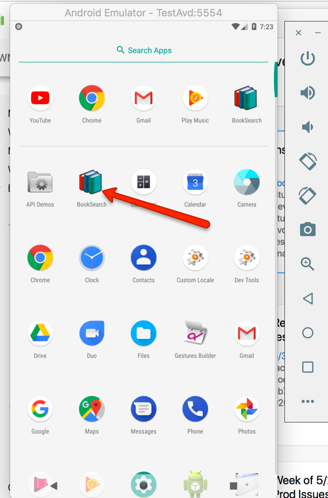

# Installation Instructions for Android SDK and Appium (MacOS)

### 1 - Install latest Android SDK
	https://developer.android.com/studio/install.html

### 2 - The installer will install Android SDK in the following location
	/Users/<YOUR-USERNAME>/Library/Android/sdk

### 3 - Edit your .bash_profile to have the following:

	export ANDROID_HOME=/Users/<YOUR-USERNAME>/Library/Android/sdk
	export ANDROID_SDK_ROOT=$ANDROID_HOME
	export JAVA_HOME=$(/usr/libexec/java_home)

	PATH=$PATH:$ANDROID_SDK_ROOT/tools/bin
	PATH=$PATH:$ANDROID_SDK_ROOT/emulator
	PATH=$PATH:$ANDROID_SDK_ROOT/platform-tools
	PATH=$PATH:$JAVA_HOME/bin

Your .bash_profile should be in ~/.bash_profile

If you don't have a .bash_profile then run this command to create it: touch ~/.bash_profile

To edit your .bash_profile run: sudo nano ~/.bash_profile

### 4 - Install latest platform tools by running the following command in a terminal ###
	sdkmanager "platform-tools" "platforms;android-26"

### 5 - download necessary packages ###
	sdkmanager "system-images;android-26;google_apis;x86"

### 6 - Create an avd with a name TestAvd - Android Virtual Device ###
	avdmanager create avd -n TestEmulator -k "system-images;android-26;google_apis;x86" -d "Nexus 5X"

### 7 - Launch the emulator to see if everything is working
	emulator -avd TestEmulator -skin 1440x2560

### 8 - Now install appium
	npm install -g appium

### 9 - Start the appium server by running the following command
	appium

### 10 Install BookSearch Test App
To install an APK file on the emulated device, drag an APK file onto the emulator screen.
An APK Installer dialog appears.
When the installation completes, you can view the app in your apps list.

